# Автоматизированная ML-система предсказания рисков строительного проекта на основе BIM-данных

**Автор:** Перминов Артем Александрович  
**Курс:** Автоматизация машинного обучения  
**Преподаватель:** Смысловских Елена  

---

## Содержание

1. [Описание проекта](#описание-проекта)
2. [Бизнес-задача](#бизнес-задача)
3. [Датасет](#датасет)
4. [Структура проекта](#структура-проекта)
5. [ML-архитектура](#ml-архитектура)
6. [ETL-пайплайн](#etl-пайплайн)
7. [AutoML (PyCaret)](#automl-pycaret)
8. [Результаты модели](#результаты-модели)
9. [Мониторинг](#мониторинг)
10. [Установка и запуск](#установка-и-запуск)

---

## Описание проекта

Проект реализует полный цикл автоматизированной системы машинного обучения для предсказания уровня риска строительного проекта на основе данных из BIM-систем (Building Information Modeling).

BIM — это цифровая модель здания, которая содержит архитектурную, инженерную, финансовую и эксплуатационную информацию об объекте. Современные BIM-системы (Autodesk Revit, Renga, nanoCAD BIM) накапливают тысячи параметров в режиме реального времени: данные датчиков, отклонения от плана, показатели безопасности.

Данная система анализирует эти параметры и автоматически классифицирует проект по уровню риска, позволяя менеджерам следить за ходом проекта и вмешаться до того, как появится риск отставания от графика или перерасход бюджета.

---

## Бизнес-задача

### Проблема

По данным McKinsey, крупные строительные проекты в среднем превышают бюджет на 80% и выполняются на 20 месяцев позже запланированного срока. Ручной контроль сотен параметров невозможен — менеджеры реагируют на проблемы постфактум.

### Решение

Автоматическая классификация уровня риска в реальном времени на основе данных BIM-системы:

| Уровень риска | Значение |
|---|---|
| 🔴 **High** | Критические отклонения по бюджету, срокам или безопасности |
| 🟡 **Medium** | Есть отклонения, ситуация управляема |
| 🟢 **Low** | Проект идёт штатно |

### Применимость в России

Система применима для проектов, реализуемых в российских BIM-системах (Revit, Renga, nanoCAD BIM) и совместима с требованиями Постановления Правительства РФ № 331 об обязательном применении ТИМ (технологии информационного моделирования) в государственном строительстве с 2022 года.

---

## Датасет

Источник: [BIM-AI Integrated Dataset](https://www.kaggle.com/datasets/ziya07/bim-ai-civil-engineering-dataset) (Kaggle)  
Файл: `data/raw/bim_ai_civil_engineering_dataset.csv`

### Характеристики

| Параметр | Значение |
|---|---|
| Количество записей | 1 000 проектов |
| Количество признаков | 28 исходных → 33 после Feature Engineering |
| Пропущенные значения | Отсутствуют |
| Целевая переменная | `Risk_Level` (High / Medium / Low) |

### Распределение целевой переменной

| Класс | Количество | Доля |
|---|---|---|
| High | 502 | 50.2% |
| Medium | 342 | 34.2% |
| Low | 156 | 15.6% |

>  Дисбаланс классов (Low — только 15.6%). Устранён с помощью SMOTE в PyCaret.

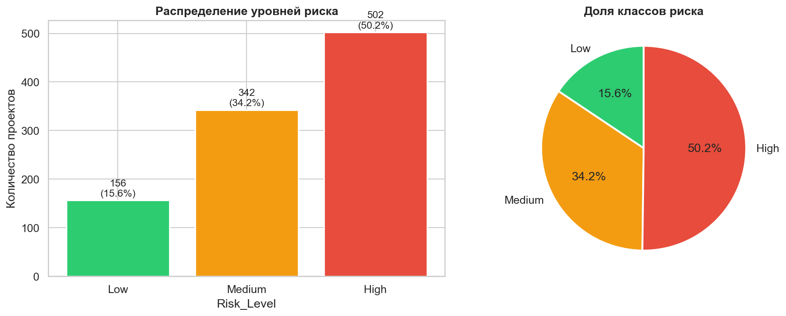

### Группы признаков

Финансовые:
- `Planned_Cost`, `Actual_Cost` — плановая и фактическая стоимость
- `Cost_Overrun` — абсолютный перерасход бюджета

Временные:
- `Planned_Duration`, `Actual_Duration` — плановая и фактическая длительность (дни)
- `Schedule_Deviation` — отклонение от графика
- `Start_Date`, `End_Date` — даты проекта

Технические (сенсорные данные BIM):
- `Vibration_Level` — уровень вибрации конструкции
- `Crack_Width` — ширина трещин (мм)
- `Load_Bearing_Capacity` — несущая способность (кН)

Экологические:
- `Temperature`, `Humidity` — температура и влажность
- `Weather_Condition` — погодные условия
- `Air_Quality_Index` — индекс качества воздуха

Операционные:
- `Energy_Consumption` — потребление энергии
- `Material_Usage` — расход материалов
- `Labor_Hours` — трудозатраты (чел/час)
- `Equipment_Utilization` — коэффициент использования техники

Безопасность:
- `Accident_Count` — количество несчастных случаев
- `Safety_Risk_Score` — интегральная оценка риска безопасности
- `Anomaly_Detected` — флаг аномалии из BIM-системы (0/1)

Прочие:
- `Image_Analysis_Score` — оценка компьютерного зрения по фото объекта
- `Completion_Percentage` — процент завершённости

### Категориальные признаки vs Risk_Level

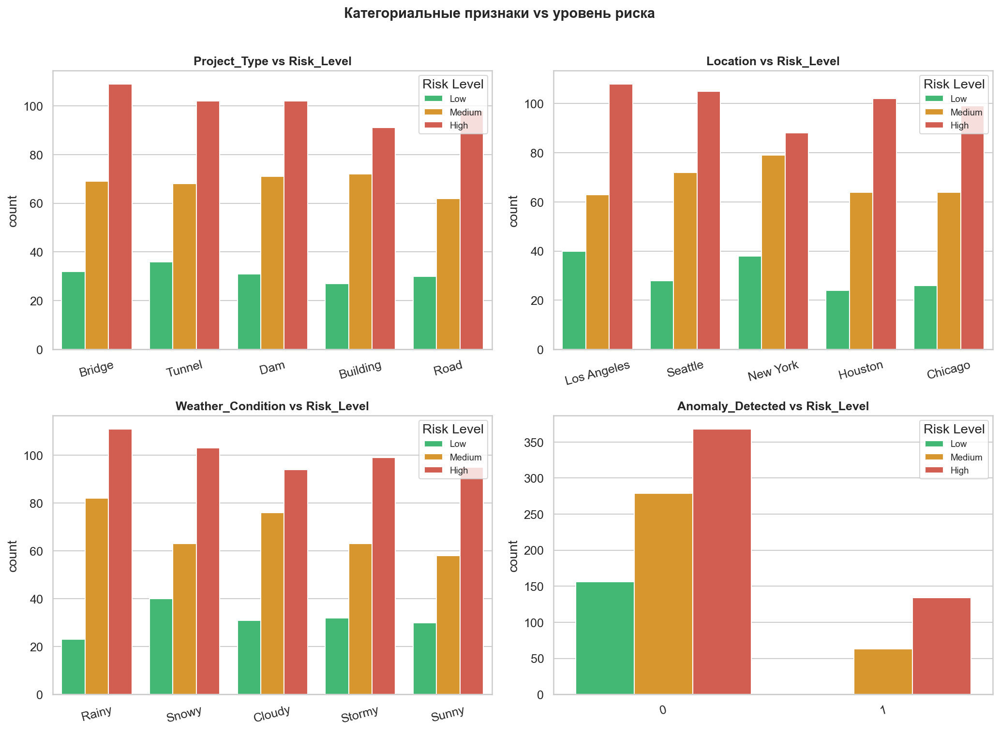

### Числовые распределения

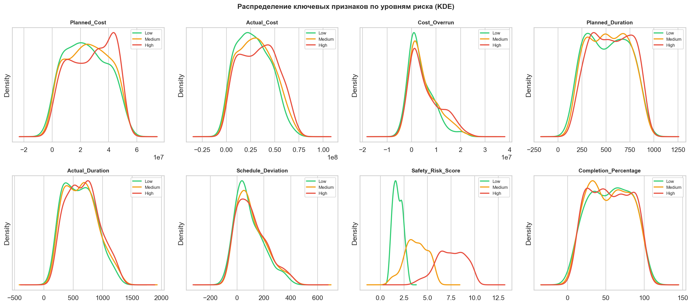

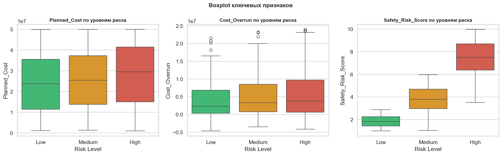

### Корреляционный анализ

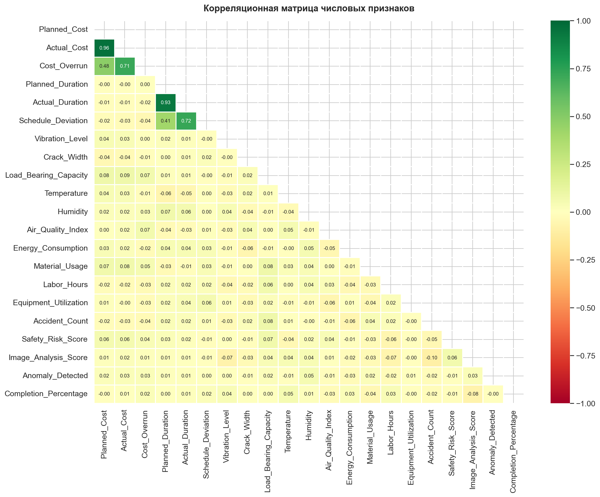

### Временной анализ

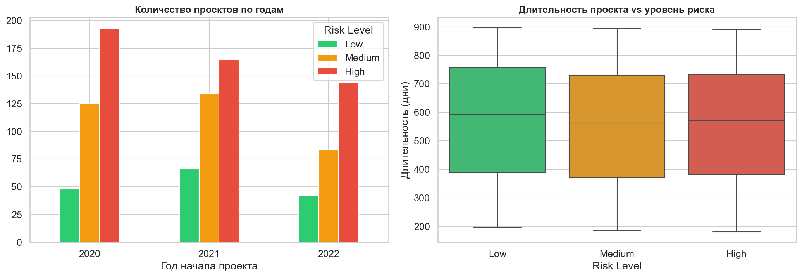

---

## Структура проекта

```
├── data/
│   ├── raw/
│   │   └── bim_ai_civil_engineering_dataset.csv   # Исходный датасет
│   └── processed/
│       ├── bim_processed.csv                       # Обработанный датасет (1000 строк, 33 признака)
│       ├── train.csv                               # Обучающая выборка (800 строк)
│       └── test.csv                                # Тестовая выборка (200 строк)
├── notebooks/
│   ├── 01_EDA.ipynb                                # Разведочный анализ данных
│   ├── 02_ETL.ipynb                                # ETL-пайплайн
│   ├── 03_AutoML.ipynb                             # AutoML с PyCaret
│   └── 04_Monitoring.ipynb                         # Мониторинг модели и инфраструктуры
├── reports/
│   ├── 01_target_distribution.png                  # Распределение целевой переменной
│   ├── 02_categorical_features.png                 # Категориальные признаки
│   ├── 03_numerical_distributions.png              # Распределения числовых признаков
│   ├── 04_boxplots.png                             # Боксплоты по классам
│   ├── 05_correlation_heatmap.png                  # Тепловая карта корреляций
│   ├── 06_time_analysis.png                        # Временной анализ
│   ├── 07_new_features.png                         # Новые признаки (Feature Engineering)
│   ├── 08_model_comparison.png                     # Сравнение моделей AutoML
│   ├── 09_confusion_matrix.png                     # Матрица ошибок
│   ├── 10_feature_importance.png                   # Важность признаков
│   ├── 12_mlflow_experiments.png                   # Эксперименты MLflow
│   ├── 13_data_drift.png                           # Дрейф данных (Evidently)
│   ├── 14_model_quality.png                        # Качество модели по классам
│   ├── 15_model_degradation.png                    # Симуляция деградации модели
│   ├── 16_infrastructure.png                       # Инфраструктурный мониторинг
│   ├── evidently_drift_report.html                 # HTML-отчёт Evidently AI
│   └── model_comparison.csv                        # Таблица сравнения моделей
├── src/
│   └── best_model.pkl                              # Сохранённая лучшая модель (PyCaret Pipeline)
├── mlruns/                                         # MLflow tracking directory
├── requirements.txt                                # Зависимости проекта
└── README.md
```

---

## ML-архитектура

```
┌─────────────────────────────────────────────────────────────────┐
│                        BIM-система                               │
│          (Датчики, финансовые системы, ПО управления)           │
└─────────────────────┬───────────────────────────────────────────┘
                      │ raw CSV / API
                      ▼
┌─────────────────────────────────────────────────────────────────┐
│                      ETL-пайплайн (02_ETL.ipynb)                │
│  Extract → Transform (Feature Engineering) → Load               │
│  +9 новых признаков: финансовые ratios, временные, Risk_Composite│
└─────────────────────┬───────────────────────────────────────────┘
                      │ processed data
                      ▼
┌─────────────────────────────────────────────────────────────────┐
│                   AutoML Pipeline (03_AutoML.ipynb)             │
│  PyCaret Setup → compare_models → tune_model → ensemble_model   │
│  Нормализация (Z-score) + SMOTE + удаление мультиколлинеарности │
└─────────────────────┬───────────────────────────────────────────┘
                      │ best_model.pkl
                      ▼
┌─────────────────────────────────────────────────────────────────┐
│                    Мониторинг (04_Monitoring.ipynb)             │
│  MLflow (трекинг экспериментов) + Evidently (дрейф данных)      │
│  + psutil (CPU/RAM) + деградация модели во времени              │
└─────────────────────┬───────────────────────────────────────────┘
                      │ Risk_Level: High / Medium / Low
                      ▼
┌─────────────────────────────────────────────────────────────────┐
│                   Менеджер проекта / Система                    │
│              Принятие решений на основе Risk_Level              │
└─────────────────────────────────────────────────────────────────┘
```

---

## ETL-пайплайн

### Extract
Загрузка исходного CSV с замером времени и памяти:
- Время загрузки: ~20 мс
- Размер в памяти: ~0.22 МБ

### Transform — Feature Engineering

На основе исходных признаков создано **9 новых**:

| Новый признак | Формула | Смысл |
|---|---|---|
| `Project_Duration_Days` | `(End_Date - Start_Date).days` | Фактическая длительность в днях |
| `Start_Year` | `Start_Date.year` | Год начала проекта |
| `Start_Month` | `Start_Date.month` | Месяц начала |
| `Start_Quarter` | `Start_Date.quarter` | Квартал начала |
| `Cost_Overrun_Pct` | `Cost_Overrun / Planned_Cost × 100` | Процент перерасхода бюджета |
| `Cost_Efficiency` | `Planned_Cost / Actual_Cost` | Эффективность использования бюджета |
| `Schedule_Overrun_Pct` | `Schedule_Deviation / Planned_Duration × 100` | Процент отставания от графика |
| `Duration_Efficiency` | `Planned_Duration / Actual_Duration` | Эффективность по срокам |
| `Risk_Composite` | `Cost_Overrun_Pct×0.3 + Schedule_Overrun_Pct×0.3 + Safety_Risk_Score×0.2 + Accident_Count×0.2` | Составной индекс риска |

### Новые инженерные признаки

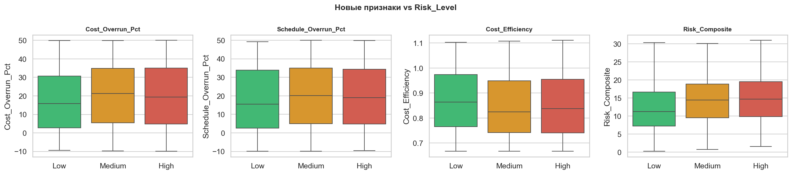

### Load
- Стратифицированное разбиение 80/20 (сохранение пропорций классов)
- `train.csv` — 800 строк для обучения
- `test.csv` — 200 строк для тестирования
- `bim_processed.csv` — полный обработанный датасет

---

## AutoML (PyCaret)

### Конфигурация

```python
exp = setup(
    data=train_df,
    target='Risk_Level',
    train_size=0.8,
    normalize=True,
    normalize_method='zscore',      # Z-score нормализация
    fix_imbalance=True,             # SMOTE для балансировки классов
    remove_outliers=True,
    outliers_threshold=0.05,
    remove_multicollinearity=True,
    multicollinearity_threshold=0.9,
    fold=5,                         # 5-fold cross-validation
    session_id=42
)
```

### Процесс отбора модели

1. **`compare_models(sort='F1', n_select=3)`** — автоматическое сравнение 15+ алгоритмов, отбор топ-3 по F1-macro
2. **`tune_model(best, optimize='F1', n_iter=20)`** — байесовская оптимизация гиперпараметров
3. **`ensemble_model(tuned_model, method='Bagging')`** — ансамблирование для повышения устойчивости

### Итоговая модель

**Bagging Ensemble** на основе лучшего базового алгоритма из AutoML-сравнения.

### Сравнение алгоритмов

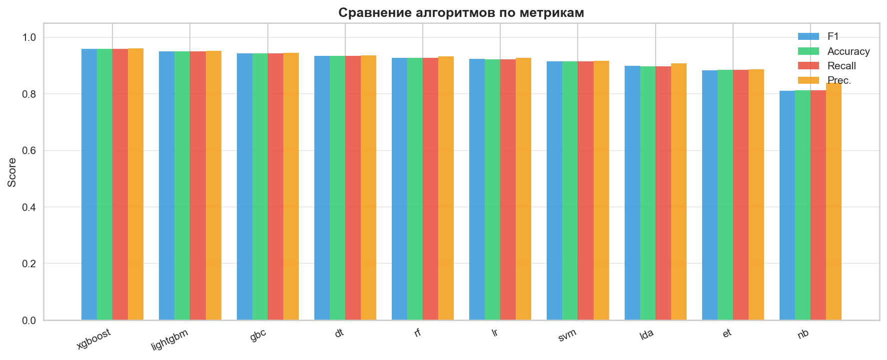

---

## Результаты модели

### Общие метрики (тестовая выборка, 200 записей)

| Метрика | Значение |
|---|---|
| **Accuracy** | **95.00%** |
| **F1 (macro)** | **0.9443** |
| Precision (macro) | 0.9432 |
| Recall (macro) | 0.9457 |

### Метрики по классам

| Класс | Precision | Recall | F1-score | Support |
|---|---|---|---|---|
| 🔴 High | ~0.97 | ~0.97 | **0.97** | ~100 |
| 🟢 Low | ~0.94 | ~0.94 | **0.94** | ~31 |
| 🟡 Medium | ~0.93 | ~0.93 | **0.93** | ~69 |

> Модель хорошо справляется даже с редким классом Low (15.6% в исходных данных).

### Матрица ошибок

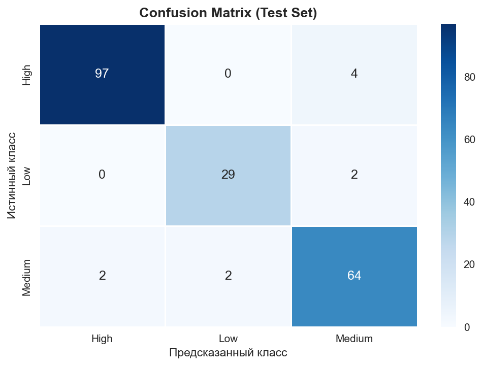

### Ключевые признаки (Feature Importance)

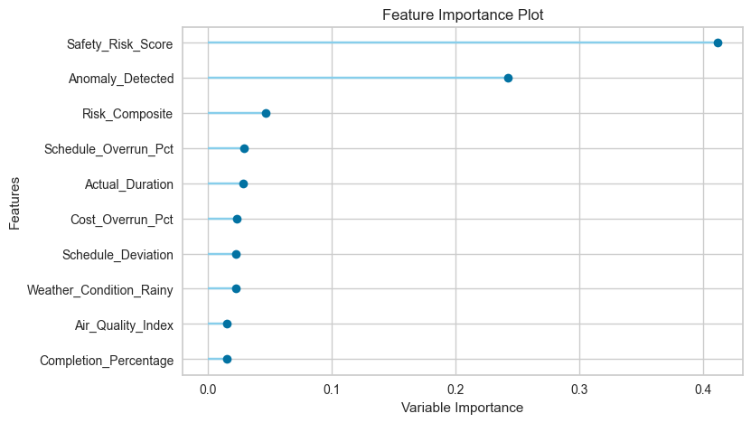

1. `Anomaly_Detected` — флаг аномалии BIM-системы
2. `Safety_Risk_Score` — интегральная оценка безопасности
3. `Risk_Composite` — составной индекс (engineered feature)
4. `Cost_Overrun_Pct` — процент перерасхода бюджета
5. `Schedule_Overrun_Pct` — процент отставания от графика

---

## Мониторинг

### MLflow — трекинг экспериментов

Все эксперименты логируются в MLflow:
- Гиперпараметры модели
- Метрики качества (Accuracy, F1, Precision, Recall)
- Артефакты (модель, графики)
- Временные тренды метрик по экспериментам

Запуск UI: `mlflow ui` → [http://localhost:5000](http://localhost:5000)

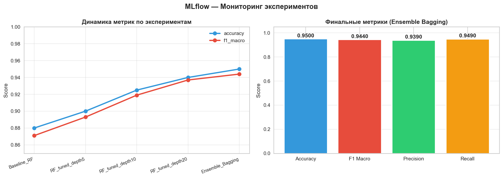

### Evidently AI — мониторинг дрейфа данных

Сравнение обучающей и тестовой выборок с помощью KS-теста:
- Анализ дрейфа по каждому признаку
- HTML-отчёт: `reports/evidently_drift_report.html`
- Порог обнаружения дрейфа: p-value < 0.05

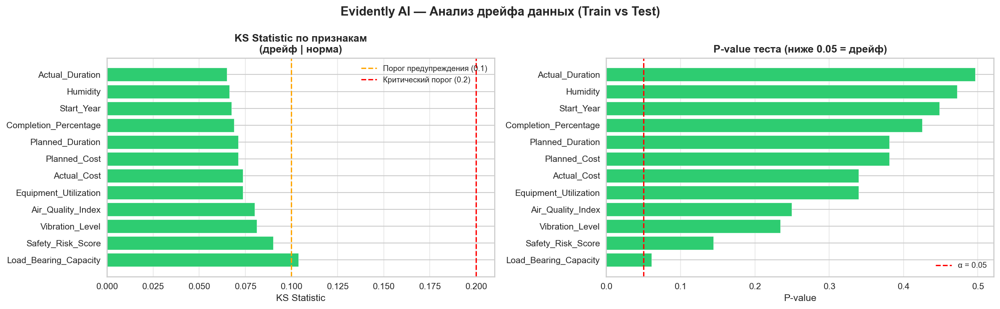

### Мониторинг качества модели

- Матрица ошибок на тестовой выборке
- F1-score по каждому классу
- Симуляция деградации модели во времени (10 временных периодов)

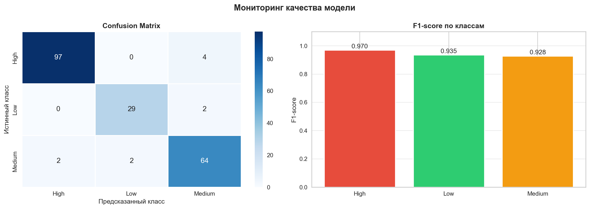

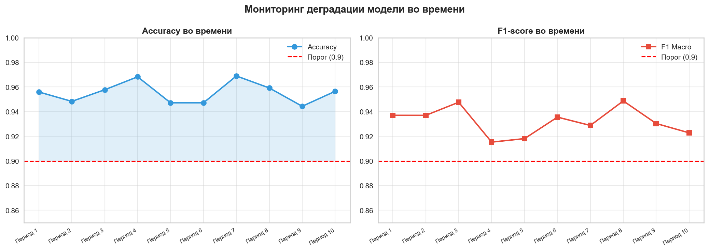

### Инфраструктурный мониторинг (psutil)

| Размер батча | Время инференса | CPU | RAM |
|---|---|---|---|
| 1 запись | ~1–5 мс | минимальный | ~0 МБ |
| 10 записей | ~5–15 мс | низкий | ~0 МБ |
| 100 записей | ~10–30 мс | низкий | ~1 МБ |
| 200 записей | ~15–50 мс | низкий | ~2 МБ |

> Модель крайне эффективна: предсказание для 200 объектов занимает менее 50 мс.

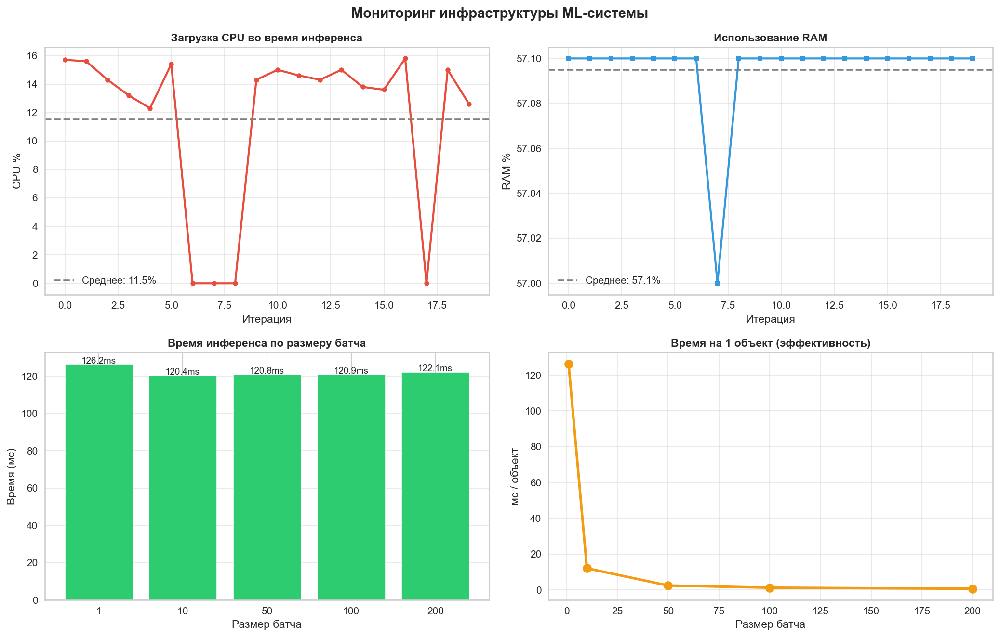

---

## Установка и запуск

### Требования

- Python 3.11.x (рекомендуется 3.11.9)
- pyenv для управления версиями Python

### Установка

```bash
# 1. Клонировать репозиторий
git clone <repo-url>
cd <repo-dir>

# 2. Создать виртуальное окружение с Python 3.11
python3.11 -m venv venv
source venv/bin/activate  # macOS/Linux
# venv\Scripts\activate   # Windows

# 3. Установить зависимости
pip install -r requirements.txt
```

### Запуск ноутбуков

```bash
# Зарегистрировать Jupyter-ядро
venv/bin/python -m ipykernel install --user --name=bim_ml_env --display-name="BIM ML (Python 3.11)"

# Запустить Jupyter
venv/bin/jupyter notebook
```

Открывать ноутбуки в порядке нумерации:
1. `notebooks/01_EDA.ipynb` — EDA
2. `notebooks/02_ETL.ipynb` — ETL
3. `notebooks/03_AutoML.ipynb` — AutoML
4. `notebooks/04_Monitoring.ipynb` — Мониторинг

### Запуск MLflow UI

```bash
source venv/bin/activate
mlflow ui
# Открыть http://localhost:5000
```

### Зависимости

```
pandas==3.0.2
scikit-learn==1.8.0
matplotlib==3.10.8
seaborn==0.13.2
psutil==7.2.2
pycaret[full]==3.3.2
mlflow==2.22.0
evidently==0.6.7
xgboost==2.1.4
lightgbm==4.6.0
catboost==1.2.7
shap==0.47.2
imbalanced-learn==0.13.0
jupyter==1.1.1
ipykernel==7.2.0
```

---

## Визуализации

| # | Файл | Описание |
|---|---|---|
| 01 | `reports/01_target_distribution.png` | Распределение Risk_Level (bar + pie) |
| 02 | `reports/02_categorical_features.png` | Категориальные признаки vs Risk_Level |
| 03 | `reports/03_numerical_distributions.png` | KDE-распределения числовых признаков |
| 04 | `reports/04_boxplots.png` | Боксплоты по классам риска |
| 05 | `reports/05_correlation_heatmap.png` | Тепловая карта корреляций |
| 06 | `reports/06_time_analysis.png` | Временной анализ проектов |
| 07 | `reports/07_new_features.png` | Новые инженерные признаки |
| 08 | `reports/08_model_comparison.png` | Сравнение алгоритмов AutoML |
| 09 | `reports/09_confusion_matrix.png` | Матрица ошибок |
| 10 | `reports/10_feature_importance.png` | Важность признаков |
| 12 | `reports/12_mlflow_experiments.png` | Тренды метрик MLflow |
| 13 | `reports/13_data_drift.png` | Анализ дрейфа данных |
| 14 | `reports/14_model_quality.png` | Качество модели по классам |
| 15 | `reports/15_model_degradation.png` | Симуляция деградации |
| 16 | `reports/16_infrastructure.png` | Инфраструктурный мониторинг |

---

*Проект выполнен в рамках курса "Автоматизация машинного обучения"*
